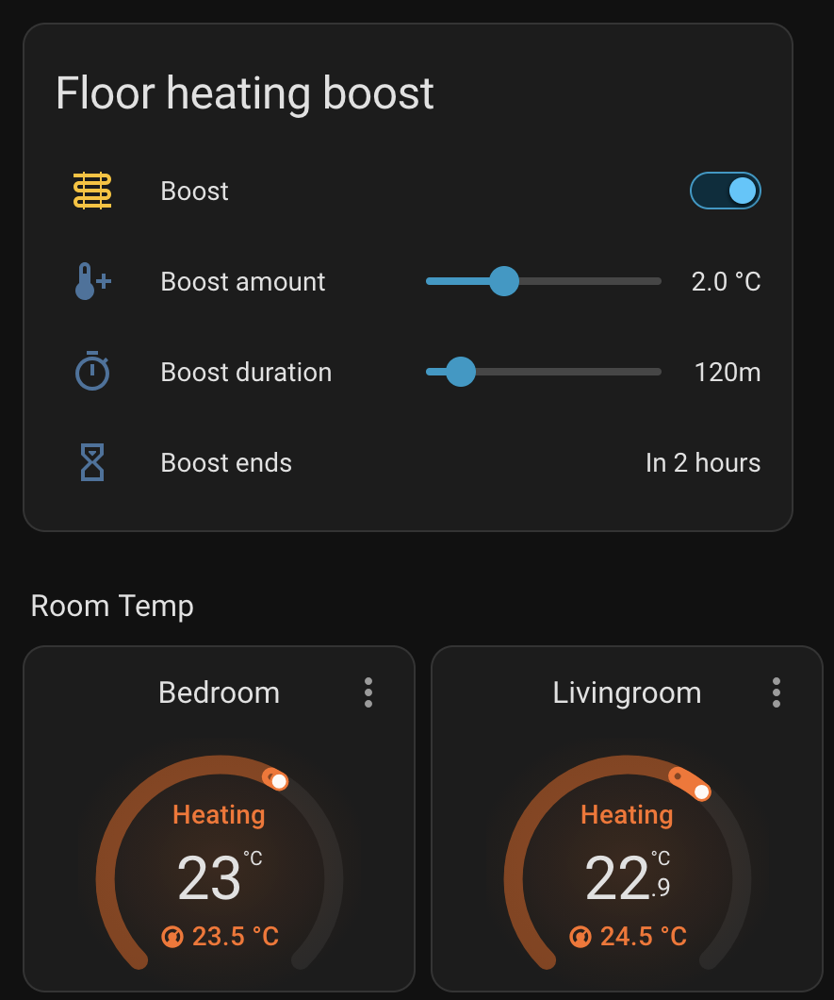

# Solar Floor Boost

A Home Assistant integration that temporarily raises the target temperature of
selected thermostats, then puts each one back to the target it had before.

Typical use: your home battery is full and the sun is still producing. Instead
of exporting the surplus, store it as heat in floor heating by raising every
thermostat by 1 °C for 2 hours. Control it from the UI, or start it from an
automation with your own conditions (battery level, PV power, outdoor
temperature, ...).



## Installation

### HACS (custom repository)

1. HACS → ⋮ → **Custom repositories** → add
   `https://github.com/alarmatwork/ha-solar-floor-boost`, type **Integration**.
2. Install **Solar Floor Boost**, then restart Home Assistant.

### Manual

Copy `custom_components/solar_floor_boost` to
`<config>/custom_components/solar_floor_boost` and restart Home Assistant.

### Setup

Settings → Devices & services → **Add integration** → **Solar Floor Boost**.
Pick the thermostats and a maximum boosted target (a safety cap, default 28 °C).
You can change both later via **Configure**.

## Entities

| Entity | Purpose |
| --- | --- |
| `switch.solar_floor_boost_boost` | On starts a boost with the values below; off stops it and restores the original targets. |
| `number.solar_floor_boost_boost_amount` | Degrees to add (default 1 °C). |
| `select.solar_floor_boost_boost_duration` | 15m, 30m, 45m, 1h … 12h (default 2h). |
| `sensor.solar_floor_boost_boost_ends` | When the boost ends. Attributes list each thermostat's original (`baseline`) and boosted (`target`) value. |

## Dashboard card

The integration ships the card in the screenshot. Edit dashboard → **Add card**
→ **By card** (or **Browse all cards**) → **Solar Floor Boost**. On Home
Assistant 2026.6+ it is also suggested under **By entity** (Community section)
when you pick any Solar Floor Boost entity.

```yaml
type: custom:solar-floor-boost-card
title: Floor heating boost  # optional
end_format: relative        # optional: relative, time, datetime, ...
```

If you prefer a plain entities card that you can customise:

```yaml
type: entities
title: Floor heating boost
show_header_toggle: false
entities:
  - entity: switch.solar_floor_boost_boost
    name: Boost
  - entity: number.solar_floor_boost_boost_amount
    name: Boost amount
  - type: custom:solar-floor-boost-duration-row  # preset slider (15m … 12h)
    entity: select.solar_floor_boost_boost_duration
    name: Boost duration
  - type: conditional
    conditions:
      - entity: switch.solar_floor_boost_boost
        state: "on"
    row:
      entity: sensor.solar_floor_boost_boost_ends
      name: Boost ends
      format: relative
```

## Actions

```yaml
action: solar_floor_boost.start
data:
  delta: 2          # optional, defaults to Boost amount
  duration: 120     # minutes (any value), optional, defaults to Boost duration
  climate_entities: # optional, defaults to all configured thermostats
    - climate.living_room
```

```yaml
action: solar_floor_boost.stop
```

See [examples/solar_surplus_automation.yaml](examples/solar_surplus_automation.yaml)
for a complete "battery full + sun + cold outside" automation.

## Behaviour

- **Original targets are remembered** per thermostat and restored when the
  boost ends. They are saved to disk, so a restart during a boost still
  restores them (right after startup if the end time passed while Home
  Assistant was down).
- **Manual changes win.** If a thermostat's target changed during the boost
  (by you, a schedule or an app), it is left as is at the end.
- **Starting again during a boost** applies the new amount to the original
  targets instead of stacking, and restarts the timer.
- All selected thermostats are boosted, whatever their mode (heat, off, idle).
  Thermostats that are **unavailable** at start are skipped. One that
  is unavailable when the boost ends is restored as soon as it comes back
  (listed in the sensor's `pending_restore` attribute).
- The boosted target is rounded to the thermostat's temperature step and capped
  at the configured maximum and the thermostat's own `max_temp`.
- Removing the integration restores all thermostats.

## Development

```bash
python -m venv .venv && . .venv/bin/activate
pip install -r requirements_test.txt
pytest
```

## Releasing

Bump `version` in `custom_components/solar_floor_boost/manifest.json` and push
to `main`. The Release workflow tags `v<version>` and publishes a GitHub
release, which HACS offers as an update.

## License

MIT
